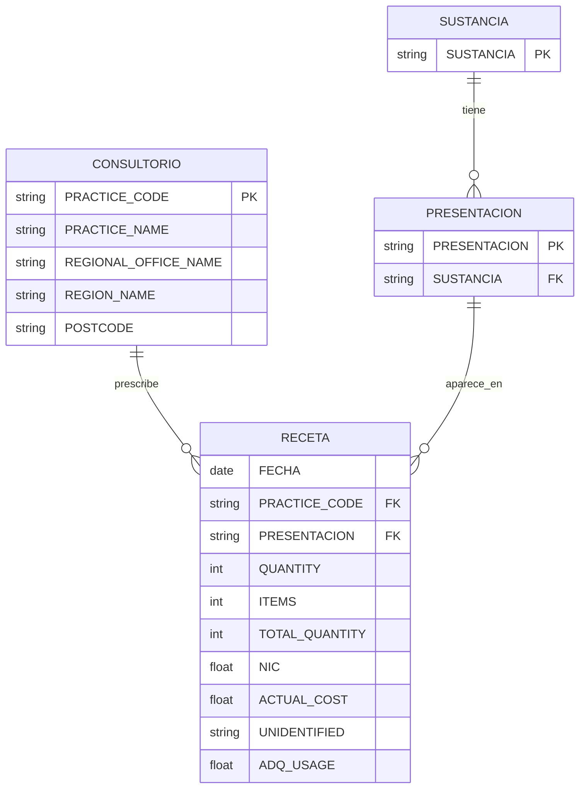

# Práctica 2 — Estadística Descriptiva

## Objetivo
Aplicar estadística descriptiva sobre el dataset de prescripciones GLP-1, identificar las entidades del modelo de datos y sus relaciones, y obtener métricas de datos agrupados relevantes para el análisis de negocio.

## Dataset base
Este análisis parte de `glp1_limpio.csv`, generado en la Práctica 1 (4,348,743 filas × 15 columnas).

## Pregunta ancla del proyecto
> ¿Qué segmentos de consultorios están impulsando el crecimiento del revenue del mercado GLP-1, y cómo está cambiando la composición de ese ingreso entre sustancias a lo largo del tiempo? ¿Existe además una desigualdad geográfica en cómo se distribuye ese revenue?

Esta pregunta guía el resto de las prácticas del semestre:
- **Revenue** → `NIC`, `ACTUAL_COST`
- **Quién lo genera** → entidad `CONSULTORIO`
- **Composición del mercado** → `SUSTANCIA`, `PRESENTACION`
- **Evolución en el tiempo** → `FECHA`
- **Geografía** → `REGIONAL_OFFICE_NAME` (cobertura completa), `REGION_NAME` (cobertura parcial)

## Modelo de entidades y relaciones

Aunque el dataset vive en una sola tabla plana, en realidad describe 4 entidades relacionadas entre sí:

- **CONSULTORIO** — quién prescribe (practice, con su código, nombre y ubicación)
- **SUSTANCIA** — el ingrediente activo del medicamento GLP-1
- **PRESENTACION** — el producto comercial específico (ej. Ozempic 1mg), relacionado con una sustancia
- **RECETA** — el evento: qué se prescribió, en qué consultorio, cuándo, y con qué volumen/costo

### Relaciones
- Una `SUSTANCIA` tiene muchas `PRESENTACION` (1:N) — ej. Liraglutide tiene varios nombres comerciales distintos (Victoza, Saxenda, Zegluxen...)
- Un `CONSULTORIO` genera muchas `RECETA` (1:N)
- Una `PRESENTACION` aparece en muchas `RECETA` (1:N)

`RECETA` no tiene llave primaria propia: no existe un campo (ni combinación de campos) que identifique de forma única cada registro individual; es el registro de un evento repetible.

## Estadística descriptiva

### Variables de revenue y volumen (dataset completo)

| | QUANTITY | ITEMS | TOTAL_QUANTITY | NIC | ACTUAL_COST |
|---|---|---|---|---|---|
| count | 4,348,743 | 4,348,743 | 4,348,743 | 4,348,743 | 4,348,743 |
| mean | 7.77 | 3.37 | 21.15 | 361.89 | 350.93 |
| std | 13.18 | 5.61 | 56.66 | 730.80 | 722.31 |
| min | 0 | 1 | 0 | 0 | 0 |
| 25% | 1 | 1 | 3 | 81.89 | 78.49 |
| 50% (mediana) | 4 | 2 | 6 | 156.96 | 156.97 |
| 75% | 4 | 3 | 16 | 360.00 | 340.95 |
| max | 930 | 318 | 4,020 | 57,240 | 56,463.07 |

**Moda:**
- `ITEMS` = **1** → la gran mayoría de las combinaciones consultorio/mes/presentación aparecen una sola vez en el formulario de recetas.
- `QUANTITY` = **4** → el tamaño de paquete más común (consistente con presentaciones inyectables tipo "pre-filled pens", que suelen venderse en cajas chicas).

**Hallazgo — asimetría en el revenue:** en `NIC` y `ACTUAL_COST`, la media (≈$362 / ≈$351) es más del doble de la mediana (≈$157 en ambas), y el máximo (~$57,000) está muy por encima del percentil 75 (~$350-360). Esto indica una **distribución con sesgo a la derecha**: la mayoría de las recetas tienen un costo moderado, pero un grupo pequeño de recetas de costo muy alto jala el promedio hacia arriba. Este patrón es consistente con el tipo de concentración de revenue que se explora más a fondo en la sección de agrupamiento.

## Métricas de datos agrupados

### Por sustancia — revenue y volumen

| SUSTANCIA | ACTUAL_COST (revenue total) | ITEMS (recetas) |
|---|---|---|
| Tirzepatide | 572,368,900 | 3,401,069 |
| Semaglutide | 433,213,700 | 4,955,543 |
| Dulaglutide | 381,273,300 | 4,892,294 |
| Liraglutide | 114,461,900 | 1,080,647 |
| Exenatide | 21,120,540 | 255,509 |
| Lixisenatide | 3,652,963 | 56,422 |

**Hallazgo 1:** Tirzepatide genera el mayor revenue total, **sin tener el mayor número de recetas** (Semaglutide y Dulaglutide la superan en `ITEMS`). Quien domina el dinero no es quien domina el volumen.

### Precio real por unidad (controlando por tamaño de paquete)

Como `QUANTITY` promedio varía mucho entre sustancias (de 1.29 en Tirzepatide a 15.11 en Semaglutide), se calculó el precio por unidad individual (`ACTUAL_COST` / `TOTAL_QUANTITY`) para aislar el efecto del tamaño de paquete del efecto del precio real:

| SUSTANCIA | costo_por_item (revenue / receta) | precio_por_unidad (revenue / unidad) | diferencia |
|---|---|---|---|
| Tirzepatide | 168.29 | 153.44 | 14.85 |
| Liraglutide | 105.92 | 36.58 | 69.34 |
| Semaglutide | 87.42 | 6.96 | 80.46 |
| Exenatide | 82.66 | 23.89 | 58.77 |
| Dulaglutide | 77.93 | 17.45 | 60.48 |
| Lixisenatide | 64.74 | 27.16 | 37.59 |

**Hallazgo 2:** Al corregir por tamaño de paquete, la diferencia de precio de Tirzepatide frente a las demás sustancias **se hace más pronunciada, no menos** — pasa de ser ~1.6x más cara que la segunda (por `costo_por_item`) a ser **más de 4x** más cara que la segunda (por `precio_por_unidad`). Esto confirma que el revenue superior de Tirzepatide no se explica por vender más unidades por receta, sino por un precio unitario genuinamente más alto.

**Hallazgo 3:** La columna `diferencia` muestra cuánto "inflaba" el `costo_por_item` original a cada sustancia por efecto del tamaño de paquete. Semaglutide tiene la mayor diferencia (80.46) — coincide con que también tiene el `QUANTITY` promedio más alto (15.11): gran parte de su costo por receta viene de traer más unidades, no de un precio unitario alto. Tirzepatide tiene la menor diferencia (14.85), consistente con su `QUANTITY` promedio más bajo (1.29): su `precio_por_unidad` es una medida confiable, poco distorsionada por tamaño de paquete.

**Hipótesis a verificar en Práctica 8 (Pronóstico):** Tirzepatide es, de las 6 sustancias, la de llegada más reciente al mercado (rollout en atención primaria de NHS hasta junio 2025), por lo que aún no enfrenta competencia de versiones genéricas. Si el precio elevado se debe a protección de patente / novedad, se esperaría ver una tendencia a la baja en `precio_por_unidad` conforme avance la serie de tiempo. Si se mantiene estable, la explicación probablemente sea otra (ej. posicionamiento de marca).

### Por región
_(pendiente — se documentará aquí una vez calculado)_

## Archivos
- `practica_2.ipynb` — notebook con el análisis completo
- Este `README.md`